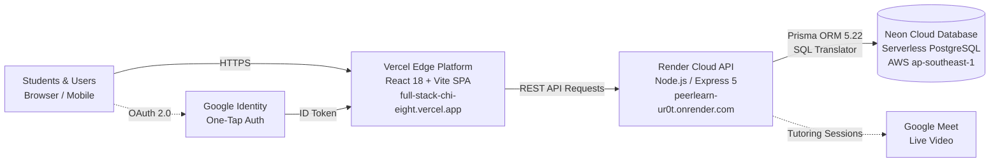
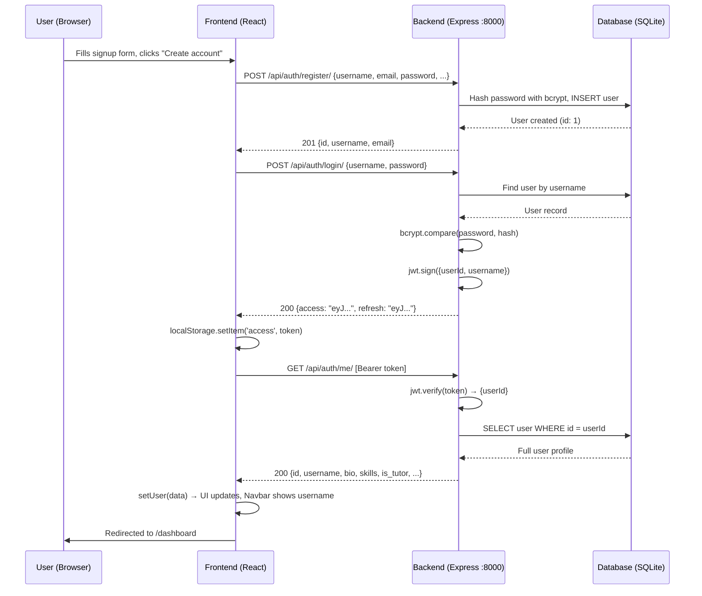

# Report 1 — How the Application Works (File-by-File Breakdown)

> This report documents every file in the PeerV2 project, explaining what each file does and how they connect to form a working full-stack application.

---

## Architecture at a Glance (Current Production Build)

> **Interactive Architecture Diagram:** A fully explorable standalone HTML diagram with dark/light themes and export options is generated at:  
> [peerlearn-production.html](file:///c:/Users/KAMALMONE/OneDrive/Desktop/FSD-PR/PeerV3/.archify/architecture-peerlearn-production-20261008-233700/peerlearn-production.html)

The application is deployed on **Vercel** (frontend), communicating securely with **Render** (Express REST API), which translates and queries **Neon Cloud PostgreSQL** via **Prisma ORM**.

---

## Backend — `PeerV2/backend-node/`

### Root Configuration Files

| File | Purpose |
|---|---|
| [package.json](file:///c:/Users/KAMALMONE/OneDrive/Desktop/FSD-PR/PeerV2/backend-node/package.json) | Declares all npm dependencies (express, prisma, bcryptjs, jsonwebtoken, multer, cors) and scripts (`npm start`, `npm run dev`) |
| [.env](file:///c:/Users/KAMALMONE/OneDrive/Desktop/FSD-PR/PeerV2/backend-node/.env) | Environment variables: database URL, JWT secrets & expiry times, port (8000), allowed frontend origin |
| [test-api.js](file:///c:/Users/KAMALMONE/OneDrive/Desktop/FSD-PR/PeerV2/backend-node/test-api.js) | Standalone smoke-test script — runs 20 API tests (register, login, CRUD, voting, etc.) to verify the backend works |

### Prisma (Database Layer)

| File | Purpose |
|---|---|
| [prisma/schema.prisma](file:///c:/Users/KAMALMONE/OneDrive/Desktop/FSD-PR/PeerV2/backend-node/prisma/schema.prisma) | **The entire database schema** — defines all 14 models (User, Domain, Subject, Resource, ResourceVote, ResourceComment, ResourceReport, LiveClass, ClassRegistration, Payment, SessionRequest, TutorReview, UserTeachingSubject) along with their fields, relationships, and unique constraints. This is the single source of truth for your data structure. |
| `prisma/migrations/` | Auto-generated SQL migration files created by `npx prisma migrate dev`. These track how the database schema evolved. |
| `prisma/dev.db` | The actual **SQLite database file** — all your data lives here. |

### Server Entry Point

| File | Purpose |
|---|---|
| [src/server.js](file:///c:/Users/KAMALMONE/OneDrive/Desktop/FSD-PR/PeerV2/backend-node/src/server.js) | **The application's main entry point.** It: (1) Loads environment variables, (2) Creates the Express app, (3) Configures middleware (CORS, JSON parsing, static file serving for `/media`), (4) Mounts all 4 route groups (`/api/auth`, `/api/resources`, `/api/classes`, `/api/tutoring`), (5) Adds a health-check endpoint, (6) Adds a global error handler, (7) Starts listening on port 8000. |

### Shared Utility

| File | Purpose |
|---|---|
| [src/lib/prisma.js](file:///c:/Users/KAMALMONE/OneDrive/Desktop/FSD-PR/PeerV2/backend-node/src/lib/prisma.js) | Creates a **singleton Prisma client** instance shared by all controllers. Every database operation goes through this single connection. |

### Middleware

| File | Purpose |
|---|---|
| [src/middleware/auth.js](file:///c:/Users/KAMALMONE/OneDrive/Desktop/FSD-PR/PeerV2/backend-node/src/middleware/auth.js) | **JWT authentication middleware.** Exports two functions: `authenticate` (blocks unauthenticated requests with 401) and `optionalAuth` (attaches user if token exists, but allows anonymous access). Both extract the Bearer token from the `Authorization` header and verify it using `jsonwebtoken`. |
| [src/middleware/upload.js](file:///c:/Users/KAMALMONE/OneDrive/Desktop/FSD-PR/PeerV2/backend-node/src/middleware/upload.js) | **File upload middleware** using Multer. Configures storage to save uploaded files to `media/resources/` with unique timestamped filenames. Used when creating/editing resources that include file attachments. |

### Routes (URL Mapping)

Each route file maps HTTP methods + URL paths to controller functions, and applies the appropriate middleware.

| File | Prefix | Endpoints Defined |
|---|---|---|
| [src/routes/auth.routes.js](file:///c:/Users/KAMALMONE/OneDrive/Desktop/FSD-PR/PeerV2/backend-node/src/routes/auth.routes.js) | `/api/auth` | `POST /register/`, `POST /login/`, `POST /refresh/`, `GET /me/`, `PATCH /me/` |
| [src/routes/resource.routes.js](file:///c:/Users/KAMALMONE/OneDrive/Desktop/FSD-PR/PeerV2/backend-node/src/routes/resource.routes.js) | `/api/resources` | Domains CRUD, Subjects CRUD, Resources CRUD, Vote, Comments CRUD, Report |
| [src/routes/class.routes.js](file:///c:/Users/KAMALMONE/OneDrive/Desktop/FSD-PR/PeerV2/backend-node/src/routes/class.routes.js) | `/api/classes` | Live Class CRUD, Register, My Registrations, Cancel Registration |
| [src/routes/tutoring.routes.js](file:///c:/Users/KAMALMONE/OneDrive/Desktop/FSD-PR/PeerV2/backend-node/src/routes/tutoring.routes.js) | `/api/tutoring` | Tutor List/Detail, Session CRUD, Reviews |

### Controllers (Business Logic)

Each controller contains the actual logic for handling requests, validating data, querying the database, and formatting responses.

| File | Handles | Key Functions |
|---|---|---|
| [src/controllers/auth.controller.js](file:///c:/Users/KAMALMONE/OneDrive/Desktop/FSD-PR/PeerV2/backend-node/src/controllers/auth.controller.js) | User accounts & auth | `register` (hash password, create user), `login` (verify credentials, issue JWT pair), `refresh` (issue new access token), `getMe` / `updateMe` (profile CRUD with teaching subjects M2M) |
| [src/controllers/resource.controller.js](file:///c:/Users/KAMALMONE/OneDrive/Desktop/FSD-PR/PeerV2/backend-node/src/controllers/resource.controller.js) | Study resources | `listDomains/createDomain`, `listSubjects/createSubject`, `listResources/createResource/getResource/updateResource/deleteResource` (with owner checks), `voteResource` (toggle logic), `listComments/createComment/deleteComment`, `reportResource` |
| [src/controllers/class.controller.js](file:///c:/Users/KAMALMONE/OneDrive/Desktop/FSD-PR/PeerV2/backend-node/src/controllers/class.controller.js) | Live group classes | `listClasses/createClass` (tutor-only), `getClass/updateClass/deleteClass` (instructor-only), `registerForClass` (mock payment, seat checks, deadline), `myRegistrations`, `cancelRegistration` (with refund), `refreshClassStatus` (auto-compute class status) |
| [src/controllers/tutoring.controller.js](file:///c:/Users/KAMALMONE/OneDrive/Desktop/FSD-PR/PeerV2/backend-node/src/controllers/tutoring.controller.js) | 1-to-1 tutoring | `listTutors/getTutor` (with ratings, reviews), `listSessions/createSession/getSession/updateSession` (role-based status transitions), `createReview` (validates completed session, no duplicates) |

---

## Frontend — `PeerV2/frontend/`

### Root Configuration Files

| File | Purpose |
|---|---|
| [package.json](file:///c:/Users/KAMALMONE/OneDrive/Desktop/FSD-PR/PeerV2/frontend/package.json) | Dependencies: React 18, React Router v6, Axios, Vite, Tailwind CSS |
| [vite.config.js](file:///c:/Users/KAMALMONE/OneDrive/Desktop/FSD-PR/PeerV2/frontend/vite.config.js) | Vite build config — enables React plugin, sets dev server to port 5173 |
| [tailwind.config.js](file:///c:/Users/KAMALMONE/OneDrive/Desktop/FSD-PR/PeerV2/frontend/tailwind.config.js) | Custom design system: paper/ink/chalk/highlight/stamp/rule colors, Source Serif / Inter / JetBrains Mono fonts, ruled-paper background pattern |
| [postcss.config.js](file:///c:/Users/KAMALMONE/OneDrive/Desktop/FSD-PR/PeerV2/frontend/postcss.config.js) | PostCSS config required by Tailwind |
| [index.html](file:///c:/Users/KAMALMONE/OneDrive/Desktop/FSD-PR/PeerV2/frontend/index.html) | HTML shell — loads Google Fonts, sets page title, creates the `#root` div, loads `main.jsx` |

### Core Application Files

| File | Purpose |
|---|---|
| [src/main.jsx](file:///c:/Users/KAMALMONE/OneDrive/Desktop/FSD-PR/PeerV2/frontend/src/main.jsx) | **React entry point.** Wraps the app in `BrowserRouter` (for routing) and `AuthProvider` (for auth state), then renders `<App />` |
| [src/App.jsx](file:///c:/Users/KAMALMONE/OneDrive/Desktop/FSD-PR/PeerV2/frontend/src/App.jsx) | **Route definitions.** Maps all 14 URL paths to their page components. Wraps protected routes in `<ProtectedRoute>`. Includes the Navbar and footer. |
| [src/index.css](file:///c:/Users/KAMALMONE/OneDrive/Desktop/FSD-PR/PeerV2/frontend/src/index.css) | **Design system CSS.** Defines reusable component classes: `.btn-primary`, `.btn-secondary`, `.input-field`, `.card`, `.eyebrow`, `.tag-chip` using Tailwind's `@layer` directive |

### API & State Management

| File | Purpose |
|---|---|
| [src/api/axios.js](file:///c:/Users/KAMALMONE/OneDrive/Desktop/FSD-PR/PeerV2/frontend/src/api/axios.js) | **Axios HTTP client.** Configured to point at `http://127.0.0.1:8000/api`. Automatically attaches the JWT Bearer token to every request. Has a **response interceptor** that auto-refreshes expired tokens using the refresh token and queues concurrent requests during refresh. |
| [src/context/AuthContext.jsx](file:///c:/Users/KAMALMONE/OneDrive/Desktop/FSD-PR/PeerV2/frontend/src/context/AuthContext.jsx) | **Global auth state.** Provides `user`, `login()`, `signup()`, `logout()`, `updateProfile()`, `refreshUser()` to all components. On mount, it checks for a stored access token and loads the user profile. |
| [src/hooks/useDomains.js](file:///c:/Users/KAMALMONE/OneDrive/Desktop/FSD-PR/PeerV2/frontend/src/hooks/useDomains.js) | **Shared hook** that fetches the Domain → Subject hierarchy once and shares it across pages (Upload Resource, Profile, Resources filter). |

### Reusable Components

| File | Purpose |
|---|---|
| [src/components/Navbar.jsx](file:///c:/Users/KAMALMONE/OneDrive/Desktop/FSD-PR/PeerV2/frontend/src/components/Navbar.jsx) | Top navigation bar — shows logo, navigation links (Dashboard, Resources, Tutoring, Live Classes) when logged in, username + logout button, or login/signup links when anonymous |
| [src/components/ProtectedRoute.jsx](file:///c:/Users/KAMALMONE/OneDrive/Desktop/FSD-PR/PeerV2/frontend/src/components/ProtectedRoute.jsx) | Route guard — redirects to `/login` if user is not authenticated; shows "Loading…" while auth state initializes |
| [src/components/ResourceCard.jsx](file:///c:/Users/KAMALMONE/OneDrive/Desktop/FSD-PR/PeerV2/frontend/src/components/ResourceCard.jsx) | Card component for displaying a resource in list views — shows type badge, title, description, domain/subject tags, uploader name, vote and comment counts |
| [src/components/Modal.jsx](file:///c:/Users/KAMALMONE/OneDrive/Desktop/FSD-PR/PeerV2/frontend/src/components/Modal.jsx) | Generic modal overlay with close button — used for session request forms, confirmations, etc. |

### Pages (14 total)

| File | Route | Purpose |
|---|---|---|
| [Home.jsx](file:///c:/Users/KAMALMONE/OneDrive/Desktop/FSD-PR/PeerV2/frontend/src/pages/Home.jsx) | `/` | Public landing page — hero section, feature highlights, call-to-action |
| [Login.jsx](file:///c:/Users/KAMALMONE/OneDrive/Desktop/FSD-PR/PeerV2/frontend/src/pages/Login.jsx) | `/login` | Login form (username + password) → calls `AuthContext.login()` → redirects to Dashboard |
| [Signup.jsx](file:///c:/Users/KAMALMONE/OneDrive/Desktop/FSD-PR/PeerV2/frontend/src/pages/Signup.jsx) | `/signup` | Registration form (username, email, name, password, confirm) → calls `AuthContext.signup()` → auto-logs in → Dashboard |
| [Dashboard.jsx](file:///c:/Users/KAMALMONE/OneDrive/Desktop/FSD-PR/PeerV2/frontend/src/pages/Dashboard.jsx) | `/dashboard` | 🔒 Overview with 3 module cards (Resources, Tutoring, Classes) + stats counters (resources shared, sessions, classes enrolled) |
| [Profile.jsx](file:///c:/Users/KAMALMONE/OneDrive/Desktop/FSD-PR/PeerV2/frontend/src/pages/Profile.jsx) | `/profile` | 🔒 Edit bio, skills, toggle tutor mode, set hourly rate, select teaching subjects |
| [Resources.jsx](file:///c:/Users/KAMALMONE/OneDrive/Desktop/FSD-PR/PeerV2/frontend/src/pages/Resources.jsx) | `/resources` | Browse all resources with search bar + domain/subject/type filters |
| [ResourceDetail.jsx](file:///c:/Users/KAMALMONE/OneDrive/Desktop/FSD-PR/PeerV2/frontend/src/pages/ResourceDetail.jsx) | `/resources/:id` | View single resource — download file / open link, vote (helpful/not helpful), comments section, report button, edit/delete (owner only) |
| [UploadResource.jsx](file:///c:/Users/KAMALMONE/OneDrive/Desktop/FSD-PR/PeerV2/frontend/src/pages/UploadResource.jsx) | `/resources/upload` or `/resources/:id/edit` | 🔒 Create or edit a resource — select domain/subject, type, title, description, file upload or external link |
| [TutorDirectory.jsx](file:///c:/Users/KAMALMONE/OneDrive/Desktop/FSD-PR/PeerV2/frontend/src/pages/TutorDirectory.jsx) | `/tutors` | Browse all tutors with search + domain/subject filters, shows rating, skills, availability |
| [TutorProfile.jsx](file:///c:/Users/KAMALMONE/OneDrive/Desktop/FSD-PR/PeerV2/frontend/src/pages/TutorProfile.jsx) | `/tutors/:id` | View a tutor's full profile — bio, skills, teaching subjects, hourly rate, all reviews, "Request a session" modal |
| [SessionRequests.jsx](file:///c:/Users/KAMALMONE/OneDrive/Desktop/FSD-PR/PeerV2/frontend/src/pages/SessionRequests.jsx) | `/sessions` | 🔒 Tabbed view: "As Student" (sent requests) / "As Tutor" (received requests) — accept/reject/cancel/complete sessions, add meeting links |
| [LiveClasses.jsx](file:///c:/Users/KAMALMONE/OneDrive/Desktop/FSD-PR/PeerV2/frontend/src/pages/LiveClasses.jsx) | `/live-classes` | Browse all scheduled group classes — search, domain/subject filter, seat availability, registration status |
| [LiveClassDetail.jsx](file:///c:/Users/KAMALMONE/OneDrive/Desktop/FSD-PR/PeerV2/frontend/src/pages/LiveClassDetail.jsx) | `/live-classes/:id` | View class details — description, instructor, date/time, price, seats remaining, register button, meeting link (when confirmed) |
| [CreateLiveClass.jsx](file:///c:/Users/KAMALMONE/OneDrive/Desktop/FSD-PR/PeerV2/frontend/src/pages/CreateLiveClass.jsx) | `/live-classes/create` | 🔒 Tutor-only form to schedule a new live class — title, subject, date, time, duration, price, min/max students, registration deadline |

> 🔒 = Requires login (wrapped in `ProtectedRoute`)

---

## Data Flow: How Login/Signup Actually Works

